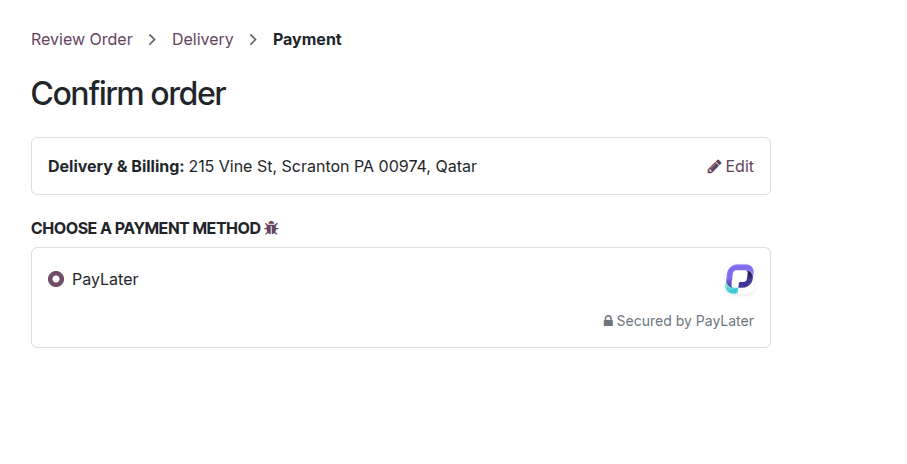
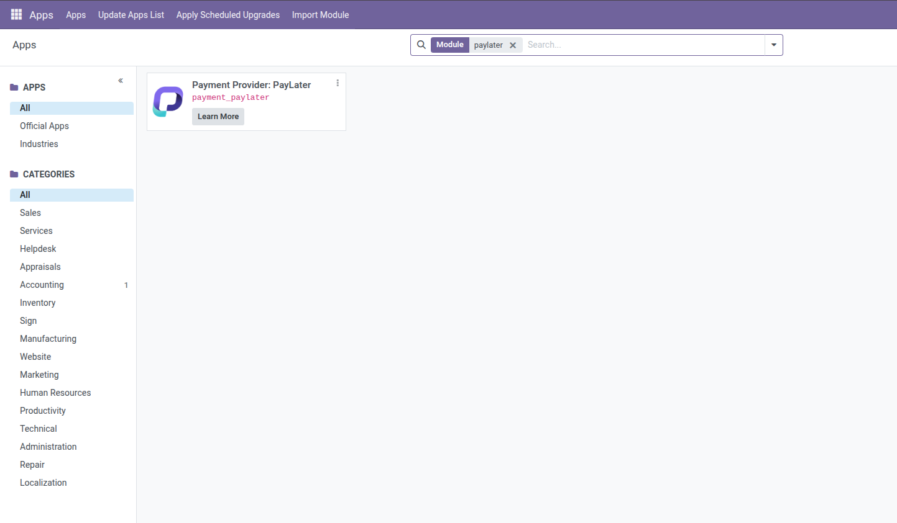
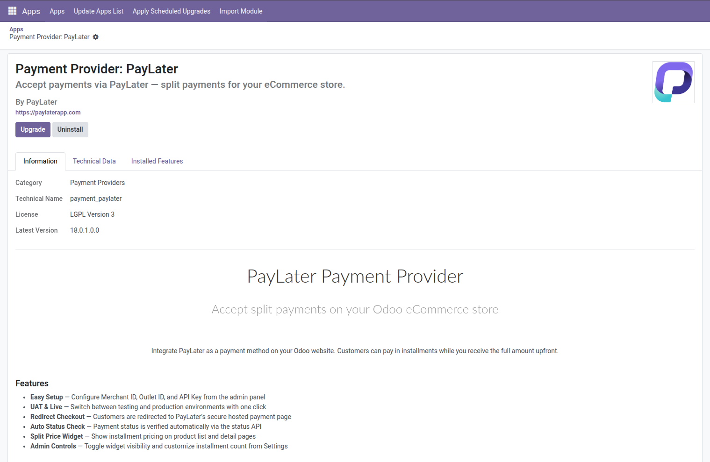
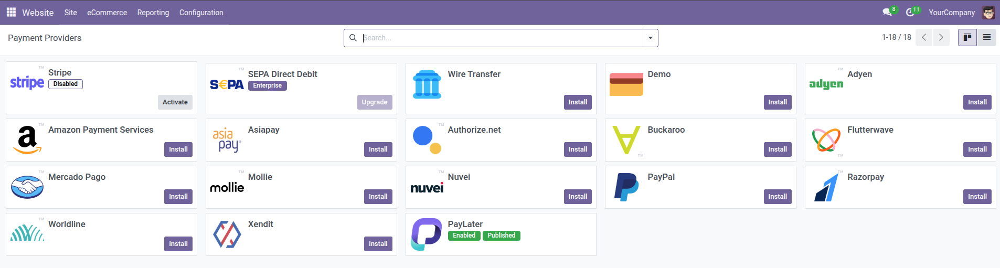
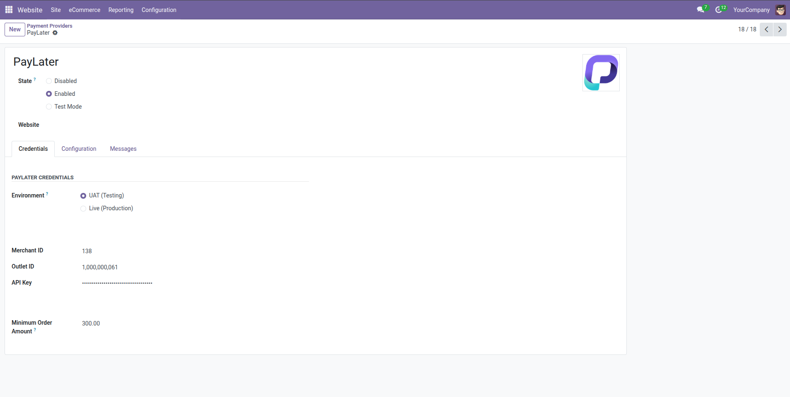
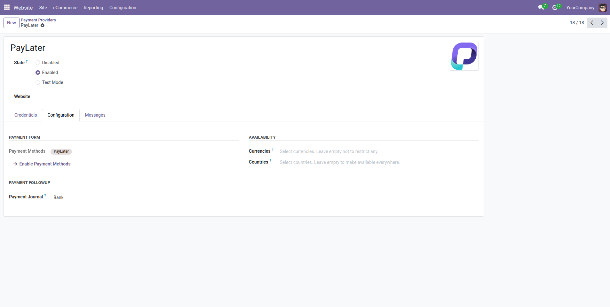
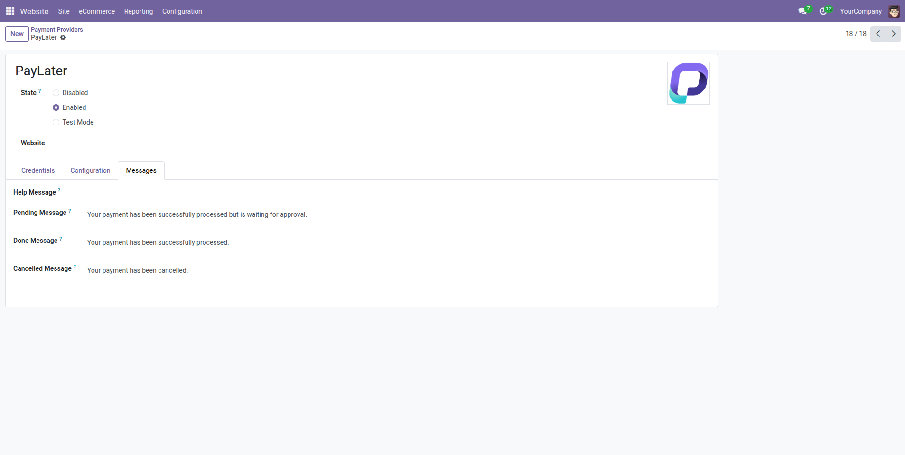
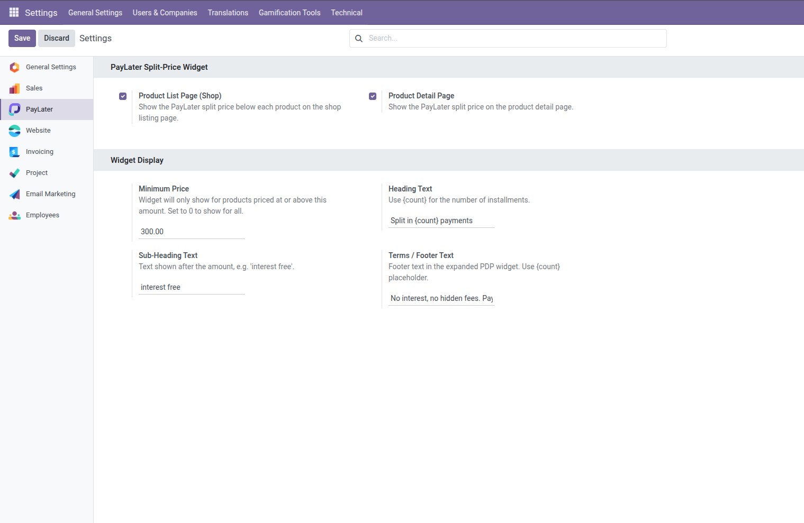

# Odoo

Empower your Odoo online store with the PayLater Odoo Plugin, a cutting-edge solution designed to enhance the purchasing journey for both merchants and customers. This seamlessly integrated plugin opens up a world of possibilities, allowing merchants to offer a convenient and flexible PayLater option at checkout.

## Download Plugin

#### Version 2.0

**Release Notes:** Webhook, Partail Refund, Full Refund, [Click Here](release-notes.md#release-notes-v2.0-may-17-2026)

**Plugin:**&#x20;



#### Version 1.0

**Release Notes:** Initial Launch, Core Payment Gateway Integration, [Click Here](release-notes.md#release-notes-v1.0-april-24-2026)

**Plugin:**&#x20;



## Installation

Paylater empowers merchants to offer the popular Buy Now, Pay Later (BNPL) payment option to their customers on their Odoo websites. This document guides you through the installation and setup process of the
&#x20;PayLater
&#x20;plugin.

### Before you begin:&#xD;

Ensure you have a
&#x20;Odoo Website
&#x20;with the
&#x20;Odoo plugin
&#x20;installed and activated.

### Frontend Widgets:

PLP Product List Page

<figure><figcaption></figcaption></figure>

PDP Product Detail Page

<figure><figcaption></figcaption></figure>

<figure><figcaption></figcaption></figure>

Checkout Page

<figure><figcaption></figcaption></figure>

## Method: Manual Installation

The manual installation method involves downloading our plugin and uploading it to your web server via your favorite FTP application. The Odoo codex contains
&#x20;[Manage Plugins](https://wordpress.org/documentation/article/manage-plugins/#Manual_Plugin_Installation)

<figure><figcaption>
After Uploading via FTP, you can see PayLater Payment Gateway in Plugin List
</figcaption></figure>

## Configurations

* Once activated, navigate to
  &#x20;**Odoo -> Apps -> Payments**
* Locate
  &#x20;PayLater
  &#x20;in the list of available payment gateways and click on the
  &#x20;Manage
  &#x20;button.

<figure><figcaption></figcaption></figure>

* Then, navigate to
  &#x20;**Odoo -> Webstite -> Configuration -> Payment Provider**

<figure><figcaption></figcaption></figure>

* Enter your
  &#x20;Merchant ID
  &#x20;and
  &#x20;Outlet ID
  &#x20;provided [here](../../#test-credentials). These credentials are crucial for secure communication between your store and the PayLater platform.

<figure><figcaption></figcaption></figure>

<figure><figcaption></figcaption></figure>

<figure><figcaption></figcaption></figure>

* For Widget settings, navigate to
  &#x20;**Setting -> Paylater**

<figure><figcaption></figcaption></figure>

* Click
  &#x20;Save Changes
  &#x20;to complete the configuration&#x20;

## Testing

To ensure smooth functionality, it's recommended to test the PayLater payment option:

* Add a product to your cart and proceed to checkout
* During checkout, select
  &#x20;PayLater
  &#x20;as the payment method.
* You will be redirected to the secure PayLater platform to complete the BNPL payment process.
* Use test shopper account provided in Testing Credentials
* Please use 300 QAR as the amount to test


