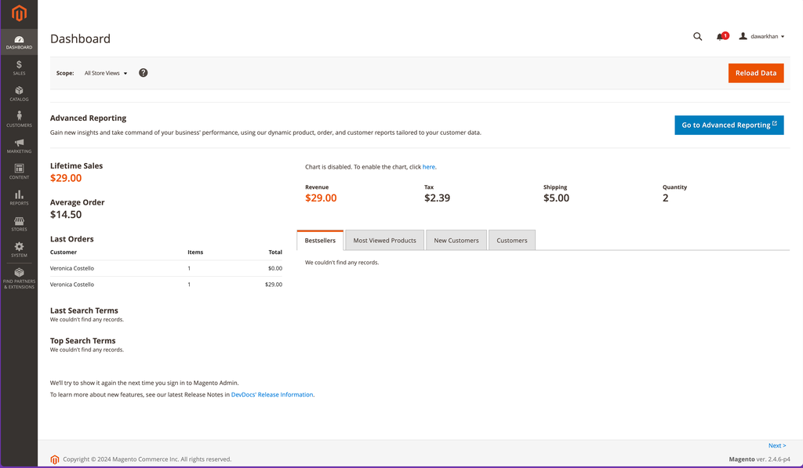
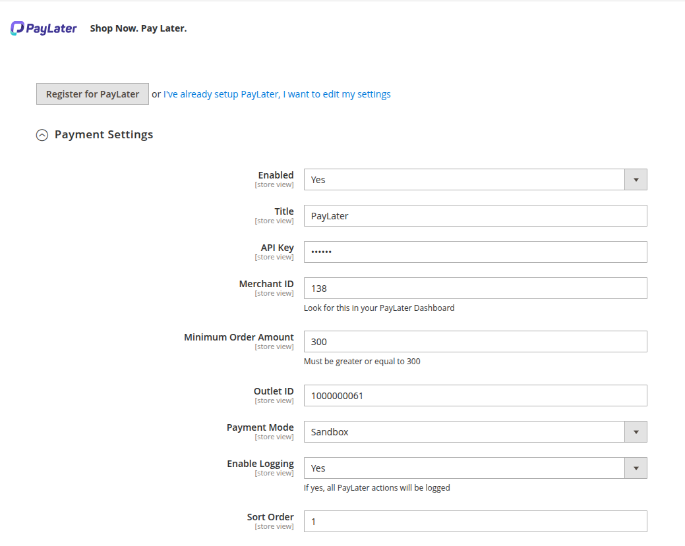

# Magento

The PayLater plugin offers merchants the ability to integrate "Buy Now, Pay Later" (BNPL) functionality into their Magento2 stores,
&#x20;providing customers with flexible payment options. This comprehensive guide will walk you through the step-by-step installation and
&#x20;configuration process for seamless integration.

## Download Plugin

#### **Version 1.3**

**Release Notes:** Technical Refactor, UI Enhancements, and Magento 2.4.7 Compatibility, [Click Here](release-notes.md#release-notes-v1.3-january-28-2026)

**Plugin:**&#x20;



#### **Version 1.2**

**Release Notes:** Initial Launch, Core Payment Gateway Integration, [Click Here](release-notes.md#release-notes-v1.2-march-28-2025)

**Plugin:**&#x20;



## Manual Setup

* In your Magento2 root directory, navigate to **\[ROOT]/app/code/** and create a folder called PayLater/PayLaterpay
* Unzip the PayLater plugin in that folder
* Enable PayLater by running the following command in your command line interface:

```
php bin/magento module:enable PayLater_PayLaterpay
```

* Run the following commands sequentially

```
php bin/magento setup:upgrade
php bin/magento setup:di:compile
php bin/magento setup:static-content:deploy
```

Login to your Magento Admin Panel.

<figure><figcaption></figcaption></figure>

## Admin Configurations

Admin Configuration is a crucial step in setting up the
&#x20;PayLater
&#x20;plugin in your Magento2 store. In this section, you'll access the Magento Admin Panel and navigate through specific settings to tailor the
\
PayLater
&#x20;payment gateway according to your preferences.

* Log in to your Magento Admin Panel.
* Navigate to
  &#x20;Stores > Configuration > Sales > Payment Methods
  &#x20;and expand
  &#x20;OTHER PAYMENT METHODS
  &#x20;tab. You will see
  &#x20;PayLater
  &#x20;Show Now Pay Later option.

<figure><figcaption></figcaption></figure>

## Payment Settings

* Under Payment Settings, you may enable or disable this payment option.
* Set the
  &#x20;Payment Mode
  &#x20;to "Live" for the live environment and "Sandbox" for testing.
* You need to get your
  &#x20;Merchant ID and Outlet ID
  &#x20;from your
  &#x20;PayLater Account Manager
* Enter your
  &#x20;Merchant ID
  &#x20;and
  &#x20;Outlet ID
  &#x20;provided here. These credentials are crucial for secure communication between your store and the PayLater platform.

<figure><figcaption></figcaption></figure>

<figure><figcaption></figcaption></figure>

* Save the configuration and
  &#x20;clear the cache
  .

## Testing

To ensure smooth functionality, it's recommended to test the PayLater payment option:

* Add a product to your cart and proceed to checkout
* During checkout, select
  &#x20;PayLater
  &#x20;as the payment method.
* You will be redirected to the secure PayLater platform to complete the BNPL payment process.
* Use test shopper account provided in Testing Credentials
* Please use 300 QAR as the amount to test


